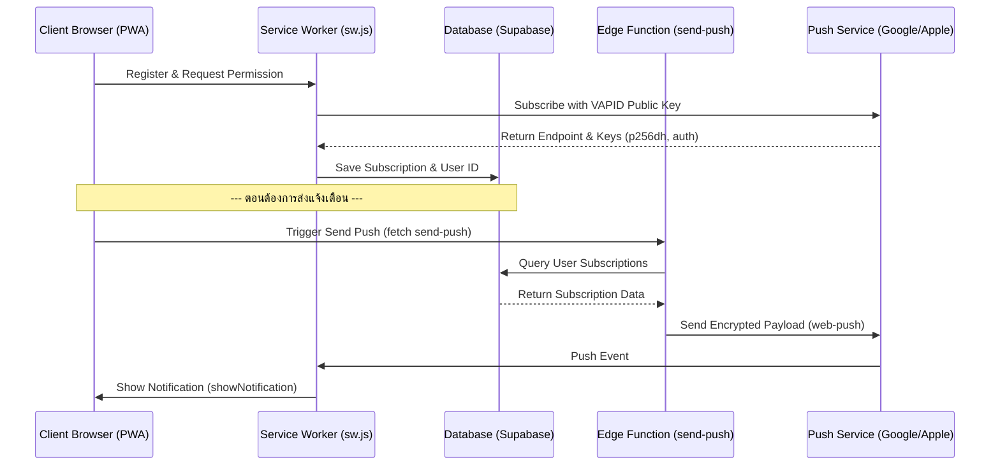

# 📱 Mobile Web Push Notification System (PWA) Extraction Guide

เอกสารนี้คู่มือสกัดและนำฟังก์ชัน **Web Push Notification** ของระบบ PWA ไปประยุกต์ใช้กับโปรเจกต์อื่นๆ โดยใช้ **Supabase** (Database + Edge Function) และเบราว์เซอร์ฝั่งไคลเอนต์ (ผ่าน **Service Worker**) ซึ่งรองรับทั้ง **Android** และ **iOS 16.4+ (ที่ติดตั้งเป็น PWA)**

---

## 🏗️ ภาพรวมสถาปัตยกรรม (Architecture Overview)



---

## 1. 🗄️ Database Schema (`UserSubscriptions`)

ใน Supabase ให้สร้างตารางสำหรับเก็บข้อมูล Token/Endpoint ของอุปกรณ์เครื่องต่างๆ:

```sql
create table public."UserSubscriptions" (
  id bigint generated by default as identity not null,
  "LineID" text not null,       -- หรือฟิลด์ ID ของผู้ใช้ในระบบอื่น (เช่น UserID, Email)
  endpoint text not null,       -- Endpoint URL ที่เบราว์เซอร์สร้างขึ้น
  p256dh text not null,         -- คีย์สำหรับการเข้ารหัส
  auth text not null,           -- คีย์สำหรับยืนยันตัวตน
  platform text null,           -- ระบบปฏิบัติการ เช่น 'ios' หรือ 'android'
  created_at timestamp with time zone default timezone('utc'::text, now()) not null,
  constraint UserSubscriptions_pkey primary key (id),
  constraint UserSubscriptions_endpoint_key unique (endpoint)
);

-- แนะนำให้สร้าง Index เพื่อให้ค้นหาได้เร็วขึ้น
create index "UserSubscriptions_LineID_idx" on public."UserSubscriptions" ("LineID");
```

---

## 2. ⚡ Backend: Supabase Edge Function (`send-push`)

สร้าง Edge Function บน Supabase ขึ้นมา 1 ตัวเพื่อทำหน้าที่ยิง Push Notification โดยใช้ไลบรารี `web-push`:

### `index.ts`
```typescript
import { createClient } from "https://esm.sh/@supabase/supabase-js@2.39.8";
import webpush from "npm:web-push";

const corsHeaders = {
  'Access-Control-Allow-Origin': '*',
  'Access-Control-Allow-Headers': 'authorization, x-client-info, apikey, content-type',
  'Access-Control-Allow-Methods': 'POST, OPTIONS'
};

Deno.serve(async (req) => {
  // จัดการ CORS
  if (req.method === 'OPTIONS') {
    return new Response('ok', { headers: corsHeaders });
  }

  try {
    const { title, body, url, targetLineId, groupCode } = await req.json();

    const supabaseUrl = Deno.env.get('SUPABASE_URL') || '';
    const supabaseServiceKey = Deno.env.get('SUPABASE_SERVICE_ROLE_KEY') || '';
    const supabase = createClient(supabaseUrl, supabaseServiceKey);

    // ดึงข้อมูล Subscriptions
    let query = supabase.from('UserSubscriptions').select('*');
    
    // ตรวจสอบเงื่อนไขผู้รับปลายทาง
    if (targetLineId === 'admin') {
      // ค้นหา LineID ของผู้ดูแลระบบในบ้าน/กลุ่มเดียวกัน
      let adminQuery = supabase
        .from('Users')
        .select('LineID')
        .or('Role.ilike.%admin%,Role.ilike.%ผู้ดูแลระบบ%,Role.ilike.%manager%,Role.ilike.%ผู้บริหาร%');
      
      if (groupCode) {
        adminQuery = adminQuery.eq('GroupCode', groupCode);
      }
      
      const { data: admins, error: adminError } = await adminQuery;
      if (adminError) throw adminError;
      
      const adminLineIds = (admins || []).map((a: any) => a.LineID).filter(Boolean);
      if (adminLineIds.length > 0) {
        query = query.in('LineID', adminLineIds);
      } else {
        return new Response(JSON.stringify({ success: true, sentCount: 0, message: 'No admins found' }), {
          headers: { ...corsHeaders, 'Content-Type': 'application/json' },
          status: 200,
        });
      }
    } else if (targetLineId && targetLineId !== 'all') {
      // ส่งเฉพาะรายบุคคล
      query = query.eq('LineID', targetLineId);
    } else if (groupCode) {
      // ส่งทุกคนเฉพาะสมาชิกในกลุ่มเดียวกัน
      const { data: users, error: userError } = await supabase
        .from('Users')
        .select('LineID')
        .eq('GroupCode', groupCode);
      
      if (userError) throw userError;
      
      const userLineIds = (users || []).map((u: any) => u.LineID).filter(Boolean);
      if (userLineIds.length > 0) {
        query = query.in('LineID', userLineIds);
      } else {
        return new Response(JSON.stringify({ success: true, sentCount: 0, message: 'No users found in this group' }), {
          headers: { ...corsHeaders, 'Content-Type': 'application/json' },
          status: 200,
        });
      }
    }

    const { data: subs, error: subError } = await query;
    if (subError) throw subError;

    const results = [];
    const pushPayload = JSON.stringify({ title, body, url });

    const vapidPublicKey = Deno.env.get('VAPID_PUBLIC_KEY') || '';
    const vapidPrivateKey = Deno.env.get('VAPID_PRIVATE_KEY') || '';

    if (!vapidPublicKey || !vapidPrivateKey) {
      throw new Error('VAPID keys are not configured in Supabase Secrets.');
    }

    // กำหนดค่า VAPID Credentials
    webpush.setVapidDetails(
      'mailto:admin@example.com',
      vapidPublicKey,
      vapidPrivateKey
    );

    if (subs && subs.length > 0) {
      for (const sub of subs) {
        try {
          await webpush.sendNotification({
            endpoint: sub.endpoint,
            keys: {
              p256dh: sub.p256dh,
              auth: sub.auth,
            }
          }, pushPayload);
          results.push({ id: sub.id, status: 'success' });
        } catch (err: any) {
          console.error(`Failed to send to endpoint: ${sub.endpoint}`, err);
          results.push({ id: sub.id, status: 'failed', error: err.message });
          
          // ลบ Subscription ที่หมดอายุ / เบราว์เซอร์ยกเลิกสิทธิ์ ออกทันที
          if (err.statusCode === 410 || err.statusCode === 404 || (err.message && err.message.includes('expired'))) {
            await supabase.from('UserSubscriptions').delete().eq('id', sub.id);
            console.log(`Deleted invalid subscription: ${sub.id}`);
          }
        }
      }
    }

    return new Response(JSON.stringify({ success: true, sentCount: results.filter(r => r.status === 'success').length, results }), {
      headers: { ...corsHeaders, 'Content-Type': 'application/json' },
      status: 200,
    });

  } catch (err: any) {
    console.error('Error in send-push function:', err);
    return new Response(JSON.stringify({ error: err.message }), {
      headers: { ...corsHeaders, 'Content-Type': 'application/json' },
      status: 400,
    });
  }
});
```

> [!TIP]
> วิธีสร้าง VAPID keys: สามารถรันคำสั่ง `npx web-push generate-vapid-keys` บนเครื่องของคุณเพื่อสุ่มค่า Public Key และ Private Key ไปตั้งค่าใน Supabase Env Secrets ได้เลย!

---

## 3. 🌐 Frontend: Client-Side Javascript (`push-notification.js`)

ไฟล์ JavaScript ฝั่ง Frontend ที่โปรเจกต์ของคุณต้องใช้เพื่อลงทะเบียนและเรียกสั่งงานแจ้งเตือน:

```javascript
// ==========================================
// 1. แปลง VAPID Public Key จาก Base64 เป็น Uint8Array
// ==========================================
function urlB64ToUint8Array(base64String) {
    const padding = '='.repeat((4 - base64String.length % 4) % 4);
    const base64 = (base64String + padding).replace(/\-/g, '+').replace(/_/g, '/');
    const rawData = window.atob(base64);
    const outputArray = new Uint8Array(rawData.length);
    for (let i = 0; i < rawData.length; ++i) {
        outputArray[i] = rawData.charCodeAt(i);
    }
    return outputArray;
}

// ==========================================
// 2. เริ่มต้นระบบ Push Notification (เมื่อโหลดแอปเสร็จ)
// ==========================================
async function initPushNotification(currentUser, supabaseClient, publicKey) {
    if (!('serviceWorker' in navigator) || !('PushManager' in window)) {
        console.warn('Push Notifications are not supported in this browser.');
        return;
    }

    if (!currentUser || !currentUser.userId) {
        console.warn('initPushNotification: No logged in user found.');
        return;
    }

    try {
        // ลงทะเบียน Service Worker และบังคับ Update
        const registration = await navigator.serviceWorker.register('sw.js');
        registration.update(); 
        console.log('Service Worker registered:', registration.scope);

        if (Notification.permission === 'denied') {
            console.warn('Notifications are blocked by the user.');
            return;
        }

        // เคลียร์ Subscription เก่า เพื่อหลีกเลี่ยงคีย์ตกค้าง
        let subscription = await registration.pushManager.getSubscription();
        if (subscription) {
            console.log('Unsubscribing old subscription...');
            await subscription.unsubscribe();
        }

        // ทำการ Subscribe ใหม่ด้วยกุญแจ VAPID Public Key
        subscription = await registration.pushManager.subscribe({
            userVisibleOnly: true,
            applicationServerKey: urlB64ToUint8Array(publicKey)
        });

        // ส่งข้อมูล Token ไปเก็บบันทึกบนฐานข้อมูล Supabase
        if (supabaseClient) {
            const subObj = subscription.toJSON();
            const p256dh = subObj.keys.p256dh;
            const auth = subObj.keys.auth;

            const { error } = await supabaseClient.from('UserSubscriptions').upsert({
                LineID: currentUser.userId,
                endpoint: subscription.endpoint,
                p256dh: p256dh,
                auth: auth,
                platform: /iPhone|iPad|iPod/i.test(navigator.userAgent) ? 'ios' : 'android'
            }, { onConflict: 'endpoint' });

            if (error) {
                console.error('❌ Failed to save Subscription to Supabase:', error);
            } else {
                console.log('✅ Subscription saved/updated in Supabase successfully');
            }
        }
    } catch (error) {
        console.error('❌ Error during Push Notification setup:', error);
    }
}

// ==========================================
// 3. ฟังก์ชันสำหรับสั่งยิง Push Notification ไปยัง Supabase Edge Function
// ==========================================
async function triggerPushNotification(supabaseUrl, supabaseKey, title, body, url = '/', targetLineId = 'all', groupCode = '') {
    try {
        const response = await fetch(`${supabaseUrl}/functions/v1/send-push`, {
            method: 'POST',
            headers: {
                'Content-Type': 'application/json',
                'Authorization': `Bearer ${supabaseKey}`
            },
            body: JSON.stringify({
                title: title,
                body: body,
                url: url,
                targetLineId: targetLineId,
                groupCode: groupCode
            })
        });
        const result = await response.json();
        console.log('📢 Push Notification response:', result);
        return result;
    } catch (e) {
        console.error('❌ Failed to trigger Push Notification:', e);
    }
}
```

---

## 4. ⚙️ Service Worker (`sw.js`)

ส่วนรับเหตุการณ์ Push Event ในไฟล์ `sw.js` (วางไว้ที่ Root Directory ของโปรเจกต์คู่กับ `manifest.json`):

```javascript
const ICON_URL = 'app-icon.png'; // รูปไอคอนที่จะให้แสดงบนการแจ้งเตือน

// 1. รับข่าวสารทาง Push Channel และสั่งเปิด Pop-up แจ้งเตือนบนเครื่องมือถือ
self.addEventListener('push', event => {
    let data = { title: 'แจ้งเตือนใหม่', body: 'มีข้อความใหม่สำหรับคุณ!', tag: 'pwa-push' };
    try {
        data = event.data.json();
    } catch (e) {
        if (event.data) data.body = event.data.text();
    }

    const options = {
        body: data.body || 'มีข้อความใหม่',
        icon: data.icon || ICON_URL,
        badge: ICON_URL,
        tag: data.tag || 'pwa-general',
        data: { url: data.url || 'index.html' },
        vibrate: [200, 100, 200],
        requireInteraction: false,
        actions: [
            { action: 'open', title: '📱 เปิดแอป' },
            { action: 'close', title: '✕ ปิด' }
        ]
    };

    event.waitUntil(
        self.registration.showNotification(data.title || 'แจ้งเตือน', options)
    );
});

// 2. จัดการเมื่อผู้ใช้กดที่การแจ้งเตือน
self.addEventListener('notificationclick', event => {
    event.notification.close();
    if (event.action === 'close') return;

    let targetPath = (event.notification.data && event.notification.data.url)
        ? event.notification.data.url
        : 'index.html';

    if (targetPath.startsWith('/')) {
        targetPath = targetPath.slice(1);
    }

    const swUrl = self.location.href;
    const baseDir = swUrl.substring(0, swUrl.lastIndexOf('/') + 1);
    let urlToOpen = new URL(targetPath, baseDir).href;

    event.waitUntil(
        clients.matchAll({ type: 'window', includeUncontrolled: true }).then(clientList => {
            // หากมีหน้า PWA เปิดอยู่แล้ว ให้โฟกัสไปที่นั่นเลย
            for (const client of clientList) {
                if (client.url.startsWith(baseDir) && 'focus' in client) {
                    return client.focus();
                }
            }
            // หากไม่ได้เปิด ให้สร้างหน้าต่างใหม่
            if (clients.openWindow) return clients.openWindow(urlToOpen);
        })
    );
});
```

---

## 🚀 ขั้นตอนการติดตั้งและรันในโปรเจกต์ใหม่
1. **สร้างตาราง `UserSubscriptions`** ในฐานข้อมูล Supabase ด้วย SQL Script ด้านบน
2. **รันคำสั่งเพื่อสร้าง Edge Function** ของ Supabase:
   ```bash
   supabase functions new send-push
   ```
3. **คัดลอกโค้ด Edge Function** ด้านบนทับลงใน `supabase/functions/send-push/index.ts`
4. **สร้างกุญแจ VAPID** (รัน `npx web-push generate-vapid-keys`)
5. **นำ VAPID Keys ไปตั้งค่า Env** ในระบบ Supabase:
   ```bash
   supabase secrets set VAPID_PUBLIC_KEY="ค่า_public_key_ที่ได้"
   supabase secrets set VAPID_PRIVATE_KEY="ค่า_private_key_ที่ได้"
   ```
6. **เพิ่มไฟล์ `sw.js`** ลงในโฟลเดอร์ Root ของเว็บไซต์โปรเจกต์ใหม่ และนำหน้าเว็บไซต์ไปผูกกับ Manifest (`manifest.json`) เพื่อรองรับสิทธิ์การติดตั้ง PWA
7. **เรียกใช้งานฝั่ง Frontend** เพื่อเปิดรับแจ้งเตือนเมื่อผู้ใช้งานล็อกอินสำเร็จ:
   ```javascript
   // ตัวอย่างการเรียกใช้หลัง Login
   initPushNotification(
       { userId: 'ID_ผู้ใช้งาน' },
       supabaseClient,
       'VAPID_PUBLIC_KEY'
   );
   ```
8. **เวลาจะส่งแจ้งเตือน** ให้เรียกฟังก์ชัน:
   ```javascript
   triggerPushNotification(
       'SUPABASE_URL',
       'SUPABASE_KEY',
       'หัวข้อแจ้งเตือน',
       'เนื้อหาข้อความ',
       '/index.html?go=details', // URL ที่จะเปิดเมื่อคลิก
       'ID_ผู้ใช้งานปลายทาง'      // หรือ 'admin' หรือ 'all'
   );
   ```
